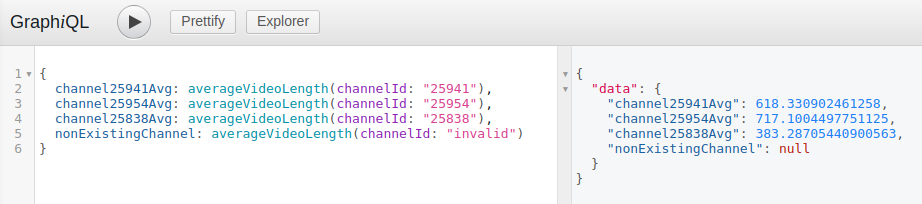

# Adding custom queries

## Simple custom queries

Adding simple custom queries that don't require a lot of customizability (for example: support for complex where conditions or resolution of deeply nested entities) can easily be done with Subsquid's [custom resolvers](https://docs.subsquid.io/graphql-api/custom-resolvers/) (`src/server-extension/resolvers`).

For example, let's imagine we want to add a query that will give us the average video length in a given channel.

We can achieve this by simply adding a new method to `ChannelsResolver` (`src/server-extension/resolvers`):

```typescript
import 'reflect-metadata'
import { Query, Resolver, Arg, Float } from 'type-graphql'
import { Channel } from '../../../model'
// ...

@Resolver()
export class ChannelsResolver {
  @Query(() => Float, { nullable: true })
  async averageVideoLength(@Arg('channelId') channelId?: string): Promise<number | null> {
    const em = await this.em()

    const result: { averageVideoLength: number } | undefined = await em
      .getRepository(Channel)
      .createQueryBuilder('channel')
      .select('AVG(video.duration)', 'averageVideoLength')
      .innerJoin('channel.videos', 'video')
      .where('channel.id = :channelId', { channelId })
      .groupBy('channel.id')
      .getRawOne()

    return result?.averageVideoLength || null
  }
}
```

### Testing new queries

The easiest way to test the query we just added would be to point Orion to a Joystream mainnet chain Subsquid archive (https://joystream.archive.subsquid.io/graphql), wait for the processor to sync all the events (which usually takes 5-10 minutes) and then execute our query to see if we get valid results:

```bash
# Set the archive endpoint to public, Subsquid-maintained Joystream mainnet archive:
export CUSTOM_ARCHIVE_GATEWAY_URL=https://joystream.archive.subsquid.io/graphql

# Prepare the workspace by running all the required codegen and build steps
make prepare

# Start Orion
make up-squid

# Follow the logs to be able to be able to see when the processor has fully processed the mainnet chain.
# This will usually take 5-10 minutes.
docker logs -f --tail 10 orion_processor
```

After you're done with those steps, you can perform [anonymous auth](./authentication-api.md#anonymous-auth) using http://localhost:4074/playground to be able to access the Graph API and then open http://localhost:4350/graphql to try a few variations of the new query:
```graphql
{
  channel25941Avg: averageVideoLength(channelId: "25941"),
  channel25954Avg: averageVideoLength(channelId: "25954"),
  channel25838Avg: averageVideoLength(channelId: "25838"),
  nonExistingChannel: averageVideoLength(channelId: "invalid")
}
```

If everything went well, you should see some results similar to those (of course the numbers may be slightly different):



## Entity query extensions

Sometimes you'll want to reuse some of the functionality of existing, autogenerated queries (like `channels`, `videosConnection` of `membershipById`) or add some additional functionality on top of those queries, ie. create an extended version of them in order to support new features.

For example, imagine you want to be able to query channels with the highest number of videos uploaded in the last `X` days.
You wouldn't be able to do that using the existing `channels` query, but implementing a completely new query (let's call it `recentlyActiveChannels`) from scratch could be challenging if you want to preserve all the other features of the `channels` query, such as:
- The ability to conditionally join other related entities and include them in the results if requested, for example:
    ```graphql
    {
      recentlyActiveChannels(days: 30) {
        videosUploaded
        channel {
          id
          title
          
          avatarPhoto { resolvedUrls }
          coverPhoto { resolvedUrls }
          ownerMember {
            handle
            metadata {
                name
            }
          }
        }
      }
    }
    ```
- The ability to specify some complex filter conditions, like:
  ```graphql
  {
    recentlyActiveChannels(
      days: 30,
      where: {
        videos_some: { title_contains: "Joystream" },
        avatarPhoto_isNull: false,
        coverPhoto_isNull: false
      }
    ) {
      # ...
    }
  }
  ```

That's why in order to implement `recentlyActiveChannels` query, it may be a good idea to make use of some functionality provided by [Subsquid's OpenReader](https://github.com/subsquid/squid-sdk/tree/%40subsquid/graphql-server_v3.2.4/openreader) library.

Here's a step by step process of how you could do that:
1. Add a new GraphQL type describing the query arguments inside `src/server-extension/resolvers/ChannelsResolver/types.ts`:
    ```typescript
      // src/server-extension/resolvers/ChannelsResolver/types.ts
      // ...

      @ArgsType()
      export class RecentlyActiveChannelsArgs {
        @Field(() => ChannelWhereInput, { nullable: true })
        where?: Record<string, unknown>

        @Field(() => Int, { nullable: false })
        limit!: number

        @Field(() => Int, { nullable: false })
        days!: number
      }
    ```
    In this specific case the `ChannelWhereInput` already exists in `src/server-extension/resolvers/baseTypes.ts` and its definition looks like this:
    ```typescript
    export const ChannelWhereInput = new GraphQLScalarType({
      name: 'ChannelWhereInput',
    })
    ```
    As you can see, it's defined as a simple scalar. However, as you will find out later once you finish adding the new query, it will be magically replaced with a correct `ChannelWhereInput` generated by `@subsquid/openreader` library in the final GraphQL API schema. This is further explained in the _[Placeholder types](#placeholder-types)_ section below.
2. You can also add a new type to describe the query result, which can include all existing fields of the `Channel`, as well as the `videosUploaded` field, which will be the number of videos added to the channel in the last `days` days:
    ```typescript
    // src/server-extension/resolvers/ChannelsResolver/types.ts
    // ...
    @ObjectType()
    export class RecentlyActiveChannelsResult {
      @Field(() => Channel, { nullable: false })
      channel!: Channel

      @Field(() => Int, { nullable: false })
      videosUploaded!: number
    }
    ```
    Just like in case of `ChannelWhereInput`, the `Channel` [type placeholder](#placeholder-types) in also already defined inside `src/server-extension/resolvers/baseTypes.ts`.
3. Now you can add a new query to the already existing `ChannelsResolver`. The detailed explanation of how it's done is provided in the comments inside the code snippet below:
    ```typescript
    // src/server-extension/resolvers/ChannelsResolver/index.ts
    import 'reflect-metadata'
    import { Query, Resolver, Args, Info, Ctx } from 'type-graphql'
    import { RecentlyActiveChannelsResult, RecentlyActiveChannelsArgs } from './types'
    import { GraphQLResolveInfo } from 'graphql'
    import { Context } from '@subsquid/openreader/lib/context'
    import { getResolveTree } from '@subsquid/openreader/lib/util/resolve-tree'
    import { parseSqlArguments, parseAnyTree } from '@subsquid/openreader/lib/opencrud/tree'
    import { ListQuery } from '@subsquid/openreader/lib/sql/query'
    import { model } from '../model'
    // ...

    @Resolver()
    export class ChannelsResolver {
      // ...
      @Query(() => [RecentlyActiveChannelsResult])
      async recentlyActiveChannels(
        @Args() args: RecentlyActiveChannelsArgs,
        @Info() info: GraphQLResolveInfo,
        @Ctx() ctx: Context
      ): Promise<RecentlyActiveChannelsResult[]> {
        // Parse the GraphQL resolve tree (which describes the shape of the result)
        // using a utility exposed by `@subsquid/openreader`
        const tree = getResolveTree(info)

        // Parse `where` and `limit` args of the query using Subsquid's `parseSqlArguments` utility
        // The 2nd argument of `parseSqlArguments` must be a name of the entity that's recognized by
        // Subsquid (so it must be defined in the input schema). In this case we want to parse the
        // `where` input of the `Channel` entity
        const sqlArgs = parseSqlArguments(model, 'Channel', {
          limit: args.limit,
          where: args.where,
        })

        // Extract the `channel` sub-tree from the resolve tree. If the query looks like like:
        // ```
        // recentlyActiveChannels(...) {
        //   channel {
        //     ...ChannelFields
        //   } 
        // }
        // ```
        // We're specifically extracting the `...ChannelFields` part of the tree here.
        const channelSubTree = tree.fieldsByTypeName.RecentlyActiveChannelsResult.channel
        // We're using `parseAnyTree` method from `@subsquid/openreader` to parse
        // the `...ChannelFields` part of the query using the 'Channel' schema definition
        const channelFields = parseAnyTree(model, 'Channel', info.schema, channelSubTree)

        // We create a `ListQuery` instance, which converts `channelFields` (parsed from the GraphQL resolve tree)
        // and `sqlArgs` (parsed from GraphQL query arguments) into a PostgreSQL query to retrieve the channels.
        // This is how the `channels` query is normally handled by Subsquid.
        const listQuery = new ListQuery(model, ctx.openreader.dialect, 'Channel', channelFields, sqlArgs)

        // We can get the SQL query string from `ListQuery`s `.sql` property
        let listQuerySql = listQuery.sql

        // We can now use Orion's `extendClause` utility function to extend the original SQL query.
        // Since we're interested in channels with the highest number of videos uploaded in the last `X` days,
        // we'll extend the SELECT clause with `num_videos_uploaded` 
        listQuerySql = extendClause(
          // The original query:
          listQuerySql,
          // The clause to extend:
          'SELECT',
          // The extension to add:
          `(
              SELECT COUNT(*) FROM "video"
              WHERE
                "video"."channel_id" = "channel"."id"
                AND "video"."created_at" > '${new Date(
                  Date.now() - args.days * 24 * 60 * 60 * 1000
                ).toISOString()}'
          ) AS num_videos_uploaded`,
          // The separator to use when joining clause with the extension (',' is the default):
          ','
        )

        // We'll also override the ORDER BY clause of the query using the `overrideClause` utility
        listQuerySql = overrideClause(
          // The original query:
          listQuerySql,
          // The clause to override:
          'ORDER BY',
          // The new value:
          `num_videos_uploaded DESC`
        )

        // We can now override `listQuery.sql` with our modified query.
        // Because `listQuery.sql` is originally a `readonly` property,
        // we need to use a type assertion "hack" for now.
        ;(listQuery as { sql: string }).sql = listQuerySql

        // We need to also override the `map` function of `listQuery`, which
        // is responsible for mapping the SQL query results to the GraphQL result.
        // First we'll store the current version of `listQuery.map` function in `oldListQMap` variable.
        const oldListQMap = listQuery.map.bind(listQuery)
        // Now we can provide our overriden version
        listQuery.map = (rows: unknown[][]) => {
          // We'll extract `num_videos_uploaded` value from each row and
          // store all values in a `numVideosUploadedValues` array
          const numVideosUploadedValues: unknown[] = []
          for (const row of rows) {
            // Since we used `extendClause` to add `num_videos_uploaded` to the SELECT statement,
            // this will be the last value of each of the result rows, so we can just use `row.pop()`
            // in order to retrieve it 
            numVideosUploadedValues.push(row.pop())
          }
          // We can now map rows from which we removed the `num_videos_uploaded` values
          // using the original map function
          const channelsMapped = oldListQMap(rows)
          // We generate the final result:
          // All standard channel fields will be mapped to `channel` property of the result elements,
          // while our new custom field will be mapped to `videosUploaded` property
          return channelsMapped.map((channel, i) => ({
            channel,
            videosUploaded: numVideosUploadedValues[i],
          }))
        }

        // Finally we execute the `listQuery` and return the result
        const result = await ctx.openreader.executeQuery(listQuery)
        return result
      }
    }
    ```
4. To test this new query, you can follow a process similar to the one described in [Testing new queries](#testing-new-queries) section. For example, you can try executing following queries:
    ```graphql
    query Top10VideoUploaders30Days {
      recentlyActiveChannels(days: 30, limit: 10) {
        channel {
          id
          title
          language
          avatarPhoto {
            resolvedUrls
          }
          coverPhoto {
            resolvedUrls
          }
        }
        videosUploaded
      }
    }

    query Top5RussianVideoUploaders7Days {
      recentlyActiveChannels(days: 7, limit: 5, where: { 
        language_eq: "ru"
      }) {
        channel {
          id
          title
          language
          avatarPhoto {
            resolvedUrls
          }
          coverPhoto {
            resolvedUrls
          }
        }
        videosUploaded
      }
    }
    ```
    Feel free to test other variations, by changing `where`, `limit` and `days` args or modifying the resolve tree in order to include different data in the results.

If you're interested in the details of how Subsquid generates the entity queries, you can inspect their repository. For example, [here](https://github.com/subsquid/squid-sdk/blob/%40subsquid/graphql-server_v3.2.4/openreader/src/opencrud/schema.ts#L405) you can find `installListQuery` method responsible for generating entity list queries (such as `channels`, `videos` etc.)

### Placeholder types

Behind the scenes, Subsquid uses `mergeSchemas` method from `@graphql-tools/schema` (see: _[Schema Merging](https://the-guild.dev/graphql/tools/docs/schema-merging)_) to merge the schema built from the custom TypeGraphQL resolvers (`src/server-extension/resolvers`) with the schema autogenerated by `@subsquid/openreader` from the [input schema](https://docs.subsquid.io/basics/schema-file/). You can see this process [here](https://github.com/subsquid/squid-sdk/blob/%40subsquid/graphql-server_v3.2.4/graphql-server/src/server.ts#L118).

In the original Subsquid implementation, the schema built from the custom resolvers is merged on top of the autogenerated schema, which means that the types defined in the custom resolvers schema take priority. In the Orion implementation however, we use a [patched version of `@subsquid/graphql-server`](../../../assets/patches/@subsquid+graphql-server+3.3.2.patch) which does the merge the other way around. This means that even if we define a type like `ChannelWhereInput` as a simple scalar in our custom resolvers, it will be overridden by the `ChannelWhereInput` type coming from the schema autogenerated by `@subsquid/openreader`.

Note however, that the definitions of 2 object types with the same name are merged together (not overridden), so if we create a _placeholder type_ with the same name as one of the autogenerated types, but with a property that doesn't exist in the original, autogenerated type, the autogenerated type will not completely override our placeholder type, but instead our new property will be added to the autogenerated type.
