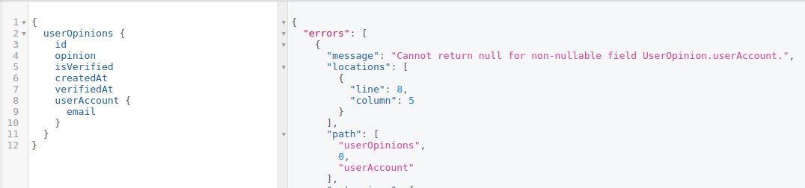
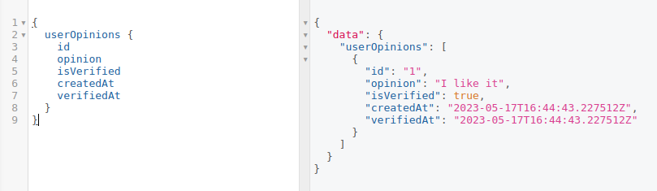
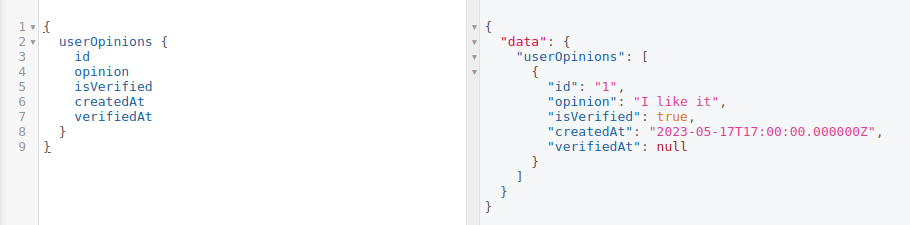
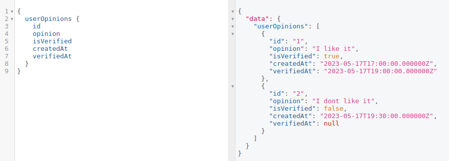

# Entity visibility

We can generally divide the data stored in Orion's database into 2 categories:
- **Public data:** The data that should be publically accessible, which includes (among others):
    - public, non-censored videos, belonging to one of the Gateway's supported video categories
    - public, non-censored channels
    - other data coming from blockchain event processing, that has not been explicitly excluded from the Gateway, like memberships, video nfts, comments, reactions etc.
- **Private data:** The data that may include sensitive content, user's private information or was explicitly hidden by the Gateway operator and therefore shouldn't be publically accessible:
    - excluded / censored channels and entities related to those channels (like videos, nfts, etc.)
    - excluded / censored videos and entities related to those videos (like nfts, comments etc.)
    - user accounts data, including sessions and other authentication-related data
    - gateway configuration values, like AppPrivateKey etc.

For this reason the Orion's database is split into 2 [schemas](https://www.postgresql.org/docs/current/ddl-schemas.html):
- `public` schema which includes publically available tables and [database views](https://www.postgresql.org/docs/current/tutorial-views.html) that "override" tables which contain (either in part or in whole) private data.
- `admin` schema which includes the original tables "overriden" by `public` views, along with all the private data.

It is very important to be aware of which schema is being used when you're executing queries against the database, otherwise you risk either exposing private data to the public or not being able to access/modify the private data you're supposed to.

You can control which schema is being used for a given transaction/connection, by setting the right value of the [`search_path`](https://www.postgresql.org/docs/current/ddl-schemas.html#DDL-SCHEMAS-PATH) PostgreSQL variable, for example:
```sql
-- make `admin` schema the default one in this transaction, making all the private data accessible
SET LOCAL search_path TO admin,public;

-- Execute some queries on private data here...

-- set the `search_path` back to default
SET LOCAL search_path TO DEFAULT
```

Some database users can also have different `search_path` set as their default. If you inspect `db/migrations/2000000000000-Views.js` file, you'll notice that we're creating an `admin` user with the `admin` schema set as the default one. The `admin` user credentials can be configured via `DB_ADMIN_USER` and `DB_ADMIN_PASSWORD` environment variables. 

The general rules about what schema is being used in which context are as follows:
- `admin` schema is by default used by Orion's event processor, as it needs to be able to process events related to hidden/censored entities as well.
- `admin` schema is also used whenever you use the global entity manager (`globalEm` from `src/utils/globalEm.ts`).
- `public` schema is by default used by the GraphQL API, also when you're executing queries from inside the custom GraphQL resolvers (if you use the injected entity manager, ie. `const em = await this.em()`), **unless** the user executing the query / mutation is an authenticated Gateway operator (in which case the `search_path` is set to `admin,public`. This is done by the `requestCheck` function inside `src/server-extension/check.ts`).
- `admin` schema is used when executring queries from inside a function wrapped in `withHiddenEntities` call (`src/utils/sql.ts`)

## Managing entity visibility

In order to adjust the visibility of the data, either because you're intoducing new entities / fields or because you'd like to change the existing rules, you can modify the `getViewDefinitions` method in `db/migrations/2000000000000-Views.js`.

This method returns an object which maps the database table name to one of the following:
- an **array** of `WHERE` conditions that will be applied to the public view of that table. Those `WHERE` conditions are used to filter out the hidden entities from the public view. They will be joined using `AND` operator. In case you wish to hide the whole table, you can set the conditions to `['FALSE']`, which will result in a view that always returns an empty result set.
- a **string** containing the entrie view query in case you need more flexibility.

Suppose you introduced a new `UserOpinion` entity, which will hold user's feedback about the Gateway. The input schema for this entity may look like this:
```graphql
type UserOpinion {
  id: ID!
  userAccount: Account!
  opinion: String!
  isVerified: Boolean!
  verifiedAt: DateTime
  createdAt: DateTime!
}
```

Since `Account` is already a hidden entity (it has a view definition with WHERE conditions set to `['FALSE']`), if someone (who's not an authenticated Gateway operator) tries to access the `userAccount` field of `UserOpinion` through a GraphQL API query, they will get an error like this:



However, if the query doesn't include the `userAccount` field, the `UserOpinion` entity will be returned as expected:



### Hiding entities by condition

Let's now suppose we want to hide all opinions that are not verified.
To do this, we can modify `db/migrations/2000000000000-Views.js` file and add the following entry to the `getViewDefinitions` method:
```js
// db/migrations/2000000000000-Views.js
// ...
module.exports = class Views2000000000000 {
    getViewDefinitions(db) {
        return {
            // ...
            // Notice we're using snake_case, because that's how the table name is defined in the database
            user_opinion: ['is_verified = TRUE'],
        }
    }
    // ...
}
```

### Hiding the value of a field

To show a more complex example, let's suppose we want to hide the value of `verifiedAt` field, so that it's only visible to an authenticated Gateway operator.

In this case, we'll provide the entire view query as a string, instead of an array of `WHERE` conditions. We'll also make use of the `db` parameter provided to the `getViewDefinitions` method, which will allow us to retrieve `UserOpinion` entity metadata, so that we don't have to hardcode all the column names in the query:
```js
// db/migrations/2000000000000-Views.js
// ...
module.exports = class Views2000000000000 {
    getViewDefinitions(db) {
        return {
            // ...
            user_opinion: `
              SELECT
                  ${db.connection
                    .getMetadata('UserOpinion')
                    // Filter out the `verified_at` column
                    .columns.filter((c) => c.databaseName !== 'verified_at')
                    .map((c) => `"${c.databaseName}"`)
                    .join(',')},
                  ${
                    // Since `verified_at` is a nullable column,
                    // we'll simply override it's value with NULL in the view.
                    // However, we need to cast NULL to the correct type
                    // in order to preserve the column type information.
                    `CAST(NULL as timestamp with time zone) as "verified_at"`
                  }
              ${
                // Remember to query the original data from the `admin` schema!
                'FROM admin.user_opinion ' +
                // We'll also add a `WHERE` condition to filter out non-verified opinions
                'WHERE is_verified = TRUE'
              }
            `,
        }
    }
    // ...
}
```

After inserting some example data, we can verify that the view works as expected.

The result when executing `userOpinions` query as a standard user:


The result when executing the same query as an authenticated Gateway operator:


### Disabling entity queries

Sometimes you may want to hide the entire entity/table from the public view. In this case you may want the users to get a clear error message (like `Unauthorized`) when they try to execute one of the entitiy queries associated with that entity, instead of just getting an empty result set.

Let's suppose you added a new entity called `UserFeedback` and you wish to hide it completely from the public view. It should only be accessible to authenticated Gateway operators, otherwise all the queries associated with this entity should return `Unauthorized`.

To achive that you should:
1. Add `UserFeedback: ['FALSE']` entry inside `getViewDefinitions` method in `db/migrations/2000000000000-Views.js` file as described above.
2. Update the `autogeneratedOperatorQueries` constant inside `src/server-extension/check.ts` with the names of all the queries that should be disabled for standard users, so usually:
    ```typescript
    // src/server-extension/check.ts
    // ...
    const autogeneratedOperatorQueries = [
      // ...
      'userFeedbackById',
      'userFeedbackByUniqueInput',
      'userFeedbacks',
      'userFeedbacksConnection',
    ]
    ```