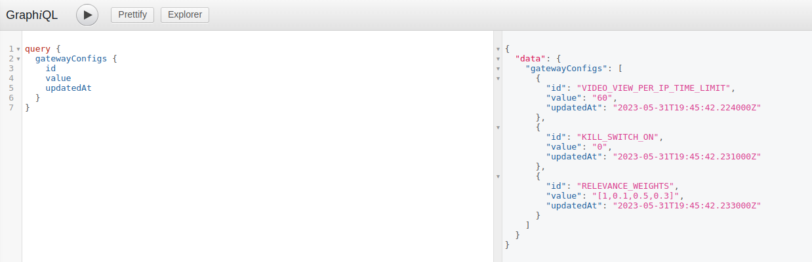

# Changing config values

While the initial Gateway config values can be provided as environment variables (see _[Initial configuration](./local-testing.md#initial-configuration)_ section in the _Local testing_ tutorial) it is important to note that some of them can later be changed via operator mutations executed through the Orion GraphQL API.

If a config value is changed this way, it will be persisted in the database (even across [upgrades](./upgrading-orion.md), as it's part of the [Offchain state](../../developer-guide/tutorials/preserving-offchain-state.md)) and take priority over the value provided as an environment variable. **This means that the actual value of a given config variable may be different than the value you see in the `.env` file!**

For example:
- You can change the value of `RELEVANCE_WEIGHTS` config variable via `setVideoWeights` mutation
- You can change the value of `KILL_SWITCH_ON` config variable via `setKillSwitch` mutation
- You can change the value of `VIDEO_VIEW_PER_USER_TIME_LIMIT` config variable via `setVideoViewPerUserTimeLimit` mutation
- You can change the value of `SUPPORT_NO_CATEGORY_VIDEOS` and `SUPPORT_NEW_CATEGORIES` config variables via `setSupportedCategories` mutation
- etc.

To ilustrate this, we'll authenticate as a Gateway Operator and execute a few mutations to change the values of some config variables:


We can now query the overriden values using the `gatewayConfigs` query:
```graphql
query {
  gatewayConfigs {
    id
    value
    updatedAt
  }
}
```

In the results, we'll only see the config values that are actually stored in the database. For all other config variables, the value provided as an environment variable will remain in effect.

