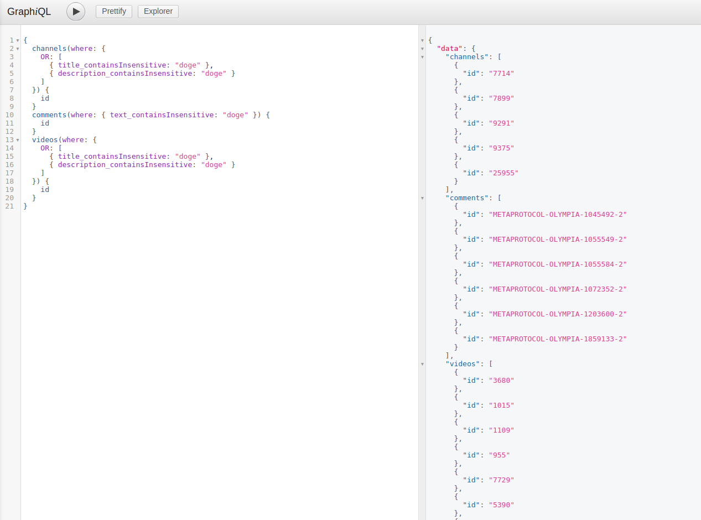
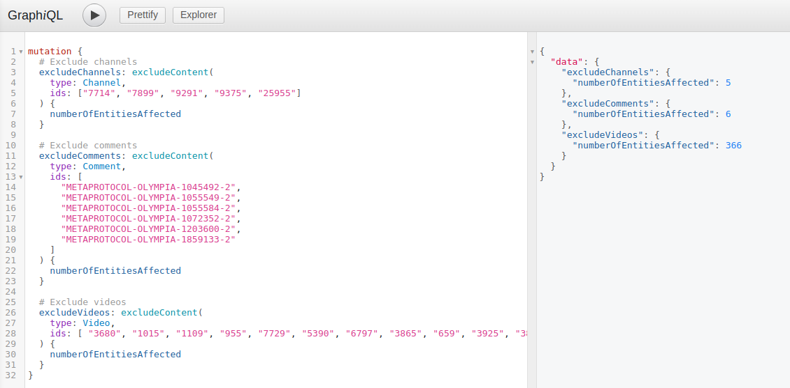
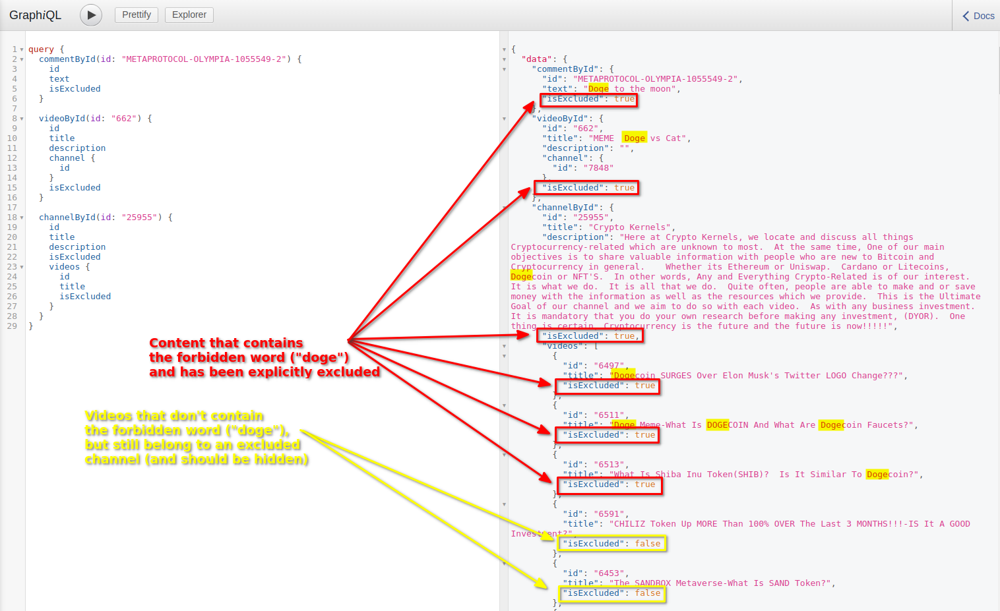
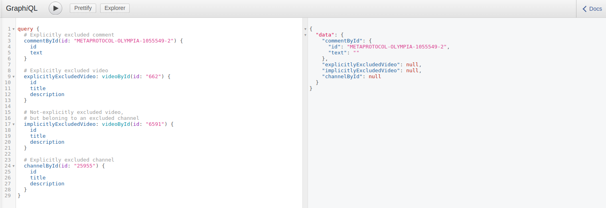
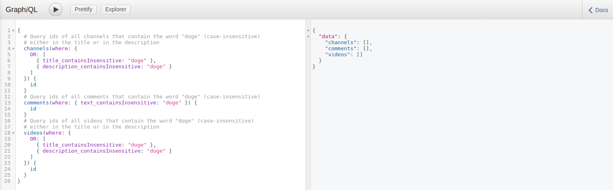
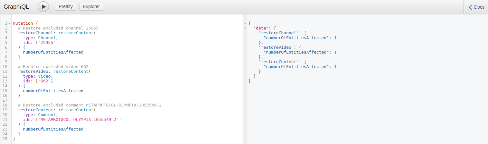
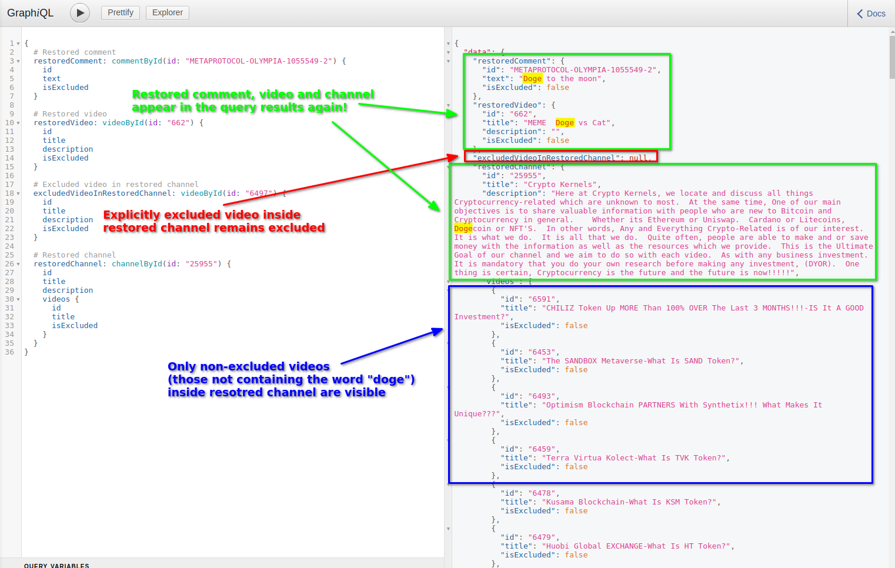

# Excluding content

**By default all content marked as _censored_ by the Joystream Content Directory Lead is excluded from all Gateways.**

However, sometimes you may want to exclude some content from your Gateway specifically, for example, because it violates your specific content policy, is illegal in the country that your Gateway is primarily trying to serve or simply because it doesn't align very well with the kind of content that your Gateway is focused on.

In Orion you have an option to exclude:
- entire channels (along with all their videos),
- individual videos (along with all their related data, like the NFT, auctions, data objects, comments etc.),
- individual video comments,

Let's imagine you want to exclude all content that contains the word _doge_ in the metadata from your gateway. To do that, you can first query the ids of all channels, videos and comments that contain this forbidden word:
    
```graphql
{
  # Query ids of all channels that contain the word "doge" (case-insensitive)
  # either in the title or in the description
  channels(where: {
    OR: [
    	{ title_containsInsensitive: "doge" },
      { description_containsInsensitive: "doge" }
    ]
  }) {
    id
  }
  # Query ids of all comments that contain the word "doge" (case-insensitive)
  comments(where: { text_containsInsensitive: "doge" }) {
    id
  }
  # Query ids of all videos that contain the word "doge" (case-insensitive)
  # either in the title or in the description
  videos(where: {
    OR: [
    	{ title_containsInsensitive: "doge" },
      { description_containsInsensitive: "doge" }
    ]
  }) {
    id
  }
}
```



Then you can prepare a mutation that will exclude channels, videos and comments with the ids you've just queried:

```graphql
mutation {
  # Exclude channels:
  excludeChannels: excludeContent(
    type: Channel,
    ids: [
      # Comma-separated list of channel ids to exclude...
    ]
  ) {
    numberOfEntitiesAffected
  }
  
  # Exclude comments:
  excludeComments: excludeContent(
    type: Comment,
    ids: [
    	# Comma-separated list of comment ids to exclude...
    ]
  ) {
    numberOfEntitiesAffected
  }
  
  # Exclude videos:
  excludeVideos: excludeContent(
    type: Video,
    ids: [
      # Comma-separated list of video ids to exclude...
    ]
  ) {
    numberOfEntitiesAffected
  }
}
```



As a Gateway operator, you will still be able to see the excluded content in the query results.
On the screen below you will see that we're querying data of a few already excluded entities:
- A video comment of id `METAPROTOCOL-OLYMPIA-1055549-2` (containing the word _Doge_ in the text)
- A video of id `662` (containing the word _Doge_ in the title)
- A channel of id `25955` (containing the word _Doge_ in the description)



Since we're authenticated as a Gateway operator, we can see all of those excluded entities and the content related to them (like the videos inside channel `25955`).

As you can notice on the screen above, some videos inside channel `25955` are not explicitly marked as `excluded`, like the video `6591`, which doesn't contain the forbidden word _Doge_ in the metadata. However, since the channel `25955` is excluded, this video will not be visible to standard users as well (as exclusion of a channel has a cascading effect on all of its related entities).

In order to take a look at the query results from a standard user perspective, we can reauthenticate using http://localhost:4074/playground/#/default/anonymousAuth without providing `userId`.

After that we can try to query the same entities, but this time Orion will give us very different results:



You will notice that the results are slightly different depending on the entity type, ie.:
- Excluded channels, excluded videos and entities related to excluded channels/videos are treated as if they don't exist at all.
- Excluded comments are teated as if they have no content (ie. the `text` field is empty), but they are still returned in the query results. **The reason for this is that an exclusion of a comment is not automatically propagated to all of its responses**, therefore we want to preserve the information that such comment existed in order for the UI to be able to display the relationship between comments correctly.

If now, as a standard user, you will try to re-execute the query we originally used to find the ids of the entities to exclude in the first place (all entities containing the word _Doge_ in the metadata), you will notice that you're getting an empty result:



If you're interested in learning technical details about how this functionality is implemented and what other entities are by default hidden from the public view, you can read the _[Entity visibility](../../developer-guide/tutorials/entity-visibility.md)_ tutorial in the Developer Guide.

## Restoring excluded content

You can restore excluded content using the `restoreContent` mutation. This mutation is basically the opposite of the `excludeContent` mutation and it accepts the same arguments.



After executing the mutation shown on the screen above, you can re-authehticate as a standard user to verify that:
1. The restored comment, video and channel are now visible in the query results.
2. Videos which were explicitly excluded inside the restored channel (like video `6497` which contains the word _Doge_ in the title) remain excluded and hidden.
3. Only videos which weren't explicitly excluded inside the restored channel (`25955`) appear under the `videos` collection of the restored channel.

