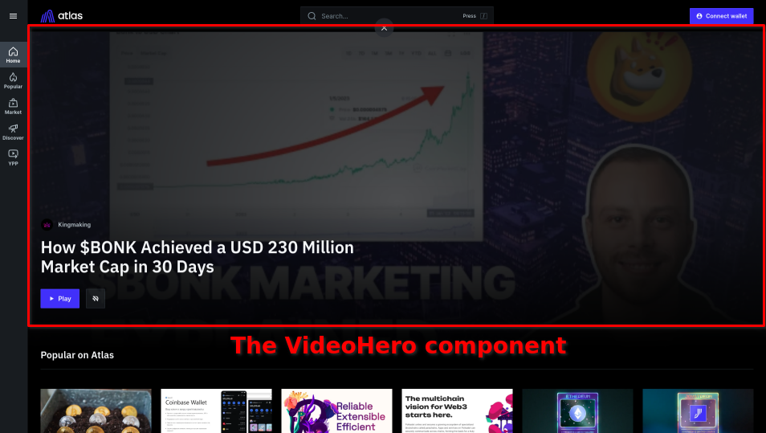

# Featuring content

Using `setVideoHero`, `setFeaturedNfts` and `setCategoryFeaturedVideos` mutations you can control the content featured on your Gateway's homepage, marketplace page and the category pages respectively.

## Video hero

**WARNING: At the time of writing this guide (29-05-2023), Atlas is experiencing a redesign and the _VideoHero_ component is no longer displayed on the homepage. The guide will be updated once the role of the _VideoHero_ component in the new design is clarified.**

The _VideoHero_ component used to be displayed on the homepage of the Atlas app. It featured a single video, usually the most popular / highest quality video available on the gateway, showing a short preview of the video (with link to the source), along with the video title and link to the channel that published the video.



As a gateway operator, you can use `setVideoHero` mutation to control the content being displayed in the _VideoHero_ component:

```graphql
mutation {
  setVideoHero(
    # The URL to the static "poster" image to be displayed in the VideoHero component
    # when the preview video is not playing (ideally ~1920x1080px)
    heroPosterUrl: "http://example.com/poster.webp",
    # The URL to the short preview of the video to be played in the VideoHero component
    videoCutUrl: "http://example.com/fragment.mp4",
    # The title of the video to be displayed in the VideoHero component
    heroTitle: "Title of the video",
	# ID of the original video featured in the _VideoHero_ component
    # (the link will point to this video's page)
    videoId: "5"
  ) {
    id
  }
}
```

To query the currently featured _VideoHero_ content you can use the `videoHero` query, for example:

```graphql
query {
  videoHero {
    video {
      id
      title
      channel {
        id
        title
      }
    }
    heroTitle
    heroVideoCutUrl
    heroPosterUrl
    activatedAt
  }
}
```

## Featured NFTs

As a Gateway operator you can also choose to feature a selection of video NFTs on the marketplace page of your Gateway:


To do that you can execute `setFeaturedNfts` mutation, simply passing a list of IDs of the NFTs you want to feature as an argument, for example:

```graphql
mutation {
  setFeaturedNfts(featuredNftsIds: [
    # IDs of the NFTs to be featured...
    "2",
    "3",
    "5"
  ]) {
    newNumberOfNftsFeatured
  }
}
```

Every time you execute `setFeaturedNfts` mutation, the current set of featured NFTs will be **replaced** with the new set you provided as the argument. This means that in order to preserve the currently featured NFTs, you need to provide their IDs as well.

In order to get the list of all currently featured nfts, you can use the `ownedNfts` query:

```graphql
ownedNfts(where: { isFeatured_eq: true }) {
  id
}
```

## Category featured videos

Finally, you can also feature a selection of videos on the category pages of your Gateway. To do that you can use the `setCategoryFeaturedVideos` mutation, providing the id of the category and a list of videos to be featured. For example:

```graphql
mutation {
  setCategoryFeaturedVideos(
    # Category id ("Investing" in this case):
    categoryId: "254433-2",
    # List of videos to be featured, along with the optional preview urls (videoCutUrl)
    videos: [
      { videoId: "5", videoCutUrl: "http://example.com/5-preview.mp4" },
      { videoId: "3616", videoCutUrl: "http://example.com/3616-preview.mp4" },
      { videoId: "866", videoCutUrl: "http://example.com/866-preview.mp4" }
    ]
  ) {
    categoryId
    numberOfFeaturedVideosUnset
    numberOfFeaturedVideosSet
  }
}
```

Simirarly to `setFeaturedNfts` mutation, every time you execute `setCategoryFeaturedVideos` mutation, the current set of videos featured in a given category will be completely **replaced** with the new set.

To see the list of videos featured in all categories, you can use `videoFeaturedInCategories` query:

```graphql
query {
  videoFeaturedInCategories {
    video {
      id
      title
    }
    category {
      id
      name
    }
    videoCutUrl
  }
}
```

You can also access the list of videos featured in a given category through `VideoCategory.featuredVideos` field, for example:

```graphql
query {
  videoCategoryById(id: "254433-2") {
    featuredVideos {
      video {
        id
        title
      }
      videoCutUrl
    }
  }
}