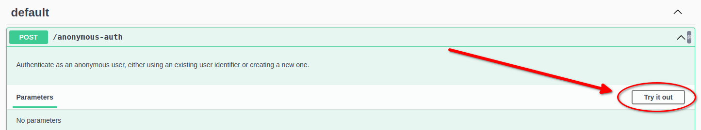
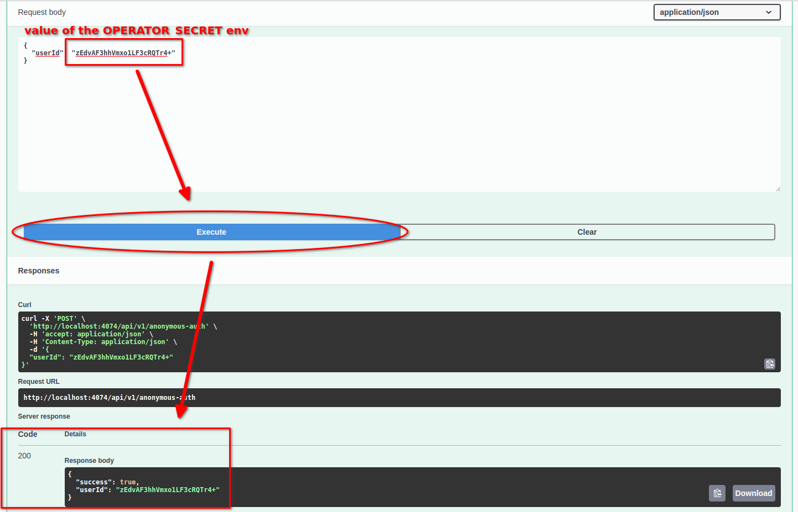
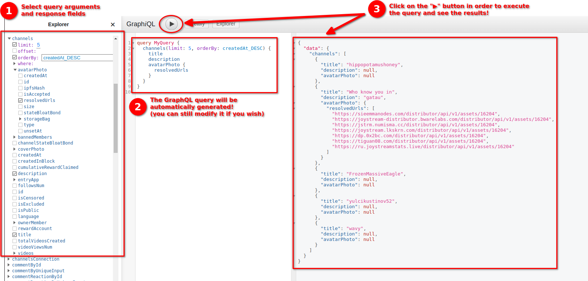
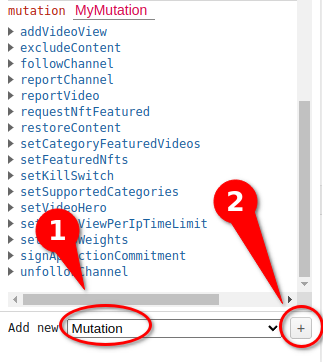
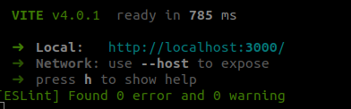

# Local testing

## Prerequisites

To run an Orion instance locally, first make sure you have [docker and docker-compose](https://docs.docker.com/engine/install/) installed on your machine.

In this tutorial we'll be using a pre-built [`joystream/orion`](https://hub.docker.com/r/joystream/orion) docker image available on Docker Hub.

We'll start with the example configuration files provided inside the [`examples/`](../examples/) directory, ie.:
- [`examples/docker-compose.yml`](../examples/docker-compose.yml)
- [`examples/.env`](../examples/.env)
- [`examples/postgres.conf`](../examples/postgres.conf)

To begin, copy those files to a chosen location on your machine.

## Initial configuration

You'll need to set some of the initial configuration values inside the `.env` file. The file already includes detailed comments explaining the meaning of each environment variable.

First, change the "placeholder values" (ie. the values inside angle brackets) such as `<YOUR GATEWAY NAME>`,
to the actual values you wish to use.

An example configuration may look like this:
```bash
# ==================================================================================
# ========================= INITIAL GATEWAY CONFIGURATION ==========================
# ==================================================================================
APP_NAME=MyGateway
SUPPORT_NO_CATEGORY_VIDEOS=false
SUPPORT_NEW_CATEGORIES=false
KILL_SWITCH_ON=true
VIDEO_VIEW_PER_USER_TIME_LIMIT=300
# Random value generated using `openssl rand -base64 18`
OPERATOR_SECRET=zEdvAF3hhVmxo1LF3cRQTr4+
RELEVANCE_WEIGHTS="[1, 0.03, 0.3, 0.5]"
VIDEO_RELEVANCE_VIEWS_TICK=10
MAX_CACHED_ENTITIES=1000
# Random value generated using `openssl rand -base64 18`
APP_PRIVATE_KEY=QWFbJcw7FHYC9eL40ctF8sns
SESSION_EXPIRY_AFTER_INACTIVITY_MINUTES=60
SESSION_MAX_DURATION_HOURS=720
EMAIL_CONFIRMATION_ROUTE=NOT_USED
EMAIL_CONFIRMATION_TOKEN_EXPIRY_TIME_HOURS=24
EMAIL_CONFIRMATION_TOKEN_RATE_LIMIT=5
ACCOUNT_OWNERSHIP_PROOF_EXPIRY_TIME_SECONDS=300
# Random value generated using `openssl rand -base64 18`
COOKIE_SECRET=upxE4P4KZtmCTkzUnKVha741
```

## Starting the services

Once you're done with the initial configuration, you can start the local Orion instance with:
```bash
docker-compose up -d
```

By default (in the example config provided), Orion will use Joystream mainnet blockchain archive gateway hosted by Subsquid (ie. `https://joystream.archive.subsquid.io/graphql`) for the purpose of fetching the on-chain event data. If you wish, you can set a different Subsquid archive endpoint by changing the value of the `ARCHIVE_GATEWAY_URL` variable in the `.env` file.

It will usually take 5-10 minutes for the Orion event processor to process all of the events from the Joystream blockchain and for the Orion database state to be in sync with the current blockchain state.

To track the progress of the event processor, you can use the following command:
```bash
docker-compose logs -f --tail 10 orion-processor
```

Once the processor is fully synced, you should start seeing log messages like those:
```
orion-processor      | {"level":2,"time":1685005084439,"ns":"sqd:processor","msg":"2393740 / 2393740, rate: 8806 blocks/sec, mapping: 1097 blocks/sec, 2427 items/sec, ingest: 481 blocks/sec, eta: 0s"}
orion-processor      | {"level":2,"time":1685005089928,"ns":"sqd:processor:mapping","msg":"Saving database updates..."}
orion-processor      | {"level":2,"time":1685005089934,"ns":"sqd:processor","msg":"2393741 / 2393741, rate: 8593 blocks/sec, mapping: 949 blocks/sec, 2277 items/sec, ingest: 370 blocks/sec, eta: 0s"}
orion-processor      | {"level":2,"time":1685005095428,"ns":"sqd:processor:mapping","msg":"Saving database updates..."}
orion-processor      | {"level":2,"time":1685005095433,"ns":"sqd:processor","msg":"2393742 / 2393742, rate: 8392 blocks/sec, mapping: 466 blocks/sec, 1763 items/sec, ingest: 118 blocks/sec, eta: 0s"}
orion-processor      | {"level":2,"time":1685005100938,"ns":"sqd:processor:mapping","msg":"Saving database updates..."}
orion-processor      | {"level":2,"time":1685005100943,"ns":"sqd:processor","msg":"2393743 / 2393743, rate: 8174 blocks/sec, mapping: 45 blocks/sec, 0 items/sec, ingest: 6 blocks/sec, eta: 0s"}
```

You can then start interacting with the APIs.

## Interacting with Orion APIs

Orion consists of 2 main APIs:
- **GraphQL API** - this is the main API used for executing GraphQL queries and mutations. For example: fetching data about channels, videos, data objects etc. or performing operator actions, such as [exluding content](./excluding-content.md), [setting supported categories](./setting-supported-categories.md) or [modyfing the gateway configuration](./changing-config-values.md).
- **Auth API** - this is the API responsible for the user authentication. It is also used for creating new user accounts and changing the most important gateway account settings, like the blockchain account associated with given gateway account. Full description of the Auth API, including many technical details, can be found in the _[Authentication API](../../developer-guide/tutorials/authentication-api.md)_ documentatin inside the developer guide.

### Authentication

The first step before you will be able to interact with the GraphQL API is to authenticate with the Auth API.
You can either authenticate as a Gateway Operator (knowing the `OPERATOR_SECRET` value from the `.env` file) or as an _anonymous user_ without any special privileges.

If the `OPENAPI_PLAYGROUND` variable in the `.env` file is set to `true`, you can use the http://localhost:4074/playground/ endpoint to interact with the Auth API and perform the authentication.

Let's select the `POST /anonymous-auth` endpoint and click "Try it out":



In order to authenticate as operator, replace `"userId": "string"` with `"userId": "<YOUR OPERATOR SECRET>"`, where `<YOUR OPERATOR SECRET>` should be the value of the `OPERATOR_SECRET` variable from the `.env` file, and click "Execute":



In order to authenticate as a standard, unprivileged user, you can just remove the `"userId": "string"` line completely and then click "Execute" again.

### GraphQL API

In order to interact with the GraphQL API, go to http://localhost:4350/graphql.
If you already [authenticated with the Auth API](#authentication), you will see a list of available queries on the left side of the screen.

You can click on one of them and it will be expanded, showing the list of available arguments that can be provided to this query and the list of fields that can be retrieved through it.
You can simply click on an argument in order to provide a value for it and select fields you wish to be included in the response and the playground will automatically generate the GraphQL query for you.
You can also modify/write the query manually if you wish. Once your query is ready, click on the "▶" button and you will see the query result on the right side of the screen:



As a gateway operator, you will also have access to multiple GraphQL mutations that you can use to perform various administrative tasks, such as [excluding](./excluding-content.md) or [featuring](./featuring-content.md) content, [setting supported categories](./setting-supported-categories.md) or [modyfing the gateway configuration](./changing-config-values.md).

In order to see the list of all available mutations, first select the "Mutation" option under "Add new" on the bottom-left side of the screen and click the "+" button:



The first mutation you will usually want to execute when setting up a new gateway is the `setSupportedCategories` mutation. To read more about setting supported categories, see _[Setting supported categories](./tutorials/setting-supported-categories.md)_ tutorial.

Below you can find a list of all tutorials that explain how to perform various administrative tasks using the GraphQL API:
- [Setting supported categories](./tutorials/setting-supported-categories.md)
- [Setting up _App attribution_](./tutorials/app-attribution.md)
- [Managing maintenance mode](./tutorials/maintenance-mode.md)
- [Changing configuration values](./tutorials/changing-config-values.md)
- [Accessing user reports](./tutorials/reported-content.md)
- [Excluding (censoring) content](./tutorials/excluding-content.md)
- [Featuring content](./tutorials/featuring-content.md)

## Testing with Atlas

You can test your local Orion instance with the local Atlas dev server, launched via `yarn atlas:dev`.

Here's a step-by-step guide on how you can configure your local environment to achieve this:

1. First make sure the following env variables are set in your `.env` file:
    ```bash
    # Dev settings
    # WARNING: DO NOT USE THESE SETTINGS IN PRODUCTION!
    ORION_ENV=development
    DEV_DISABLE_SAME_SITE=true
    ```
    As indicated in the comment, **these settings should only be used for testing purposes and should never be used in production**. They turn off some security features related to cookies that would make it more difficult to test Orion w/ Atlas locally when enabled, but which are very important in production to ensure the security of your Gateway users.
1. Clone the Atlas repository if you haven't done so already:
    ```bash
    git clone https://github.com/Joystream/atlas.git
    cd atlas
    ```
1. Install Atlas dependencies (you may need to install Yarn first)
    ```bash
    # In case you don't have Yarn installed you can install it with volta:
    # curl https://get.volta.sh | bash
    # source ~/.bash_profile || source ~/.profile || source ~/.bashrc || :
    # volta install yarn
    
    yarn
    ```
1. Adjust Atlas environment settings. To do that you can edit `.env` file inside `packages/atlas/src` directory of the Atlas repositry. You'll need to change the following values:
    1. Set `VITE_ENV` value to `local`
    1. Under `Local development env URLs` set `VITE_LOCAL_ORION_AUTH_URL` to your local Orion Auth API endpoint (`http://localhost:4074/api/v1` by default)
    1. Set `VITE_LOCAL_ORION_URL` to your local Orion GraphQL API endpoint (`http://localhost:4350/graphql` by default)
    1. Set `VITE_LOCAL_QUERY_NODE_SUBSCRIPTION_URL` to your local Orion GraphQL API WebSocket endpoint (`ws://localhost:4350/graphql` by default)
    1. Unless you're running [Joystream node](https://github.com/Joystream/joystream/tree/master/bin/node) locally, you can set `VITE_LOCAL_NODE_URL` to a public Joystream mainnet node endpoint (`wss://rpc.joystream.org:9944`) and `VITE_LOCAL_FAUCET_URL` to a public Joystream mainnet faucet endpoint (`https://faucet.joystream.org/member-faucet/register`).
1. Start the Atlas dev server:
    ```bash
    yarn atlas:dev
    ```
    You should see a message similar to this one:

    

    If you now open http://localhost:3000/ in your browser you should see the homepage of the Atlas app connected to your local Orion instance.
    If instead you see that the page never loads, please refer to https://vitejs.dev/guide/troubleshooting.html#requests-are-stalled-forever for troubleshooting tips.

You can now test how the changes you make to your local Orion instance configuration affect Atlas!
For example, you can [change supported categories](./setting-supported-categories.md), [feature](./featuring-content.md) or [exclude](./excluding-content.md) content or [adjust video relevance weights and other configuration values](./changing-config-values.md) and then see how these changes affect the content displayed in Atlas before you decide to make them in production.