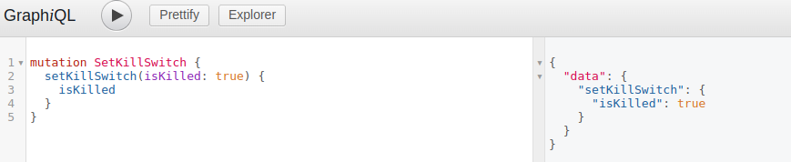
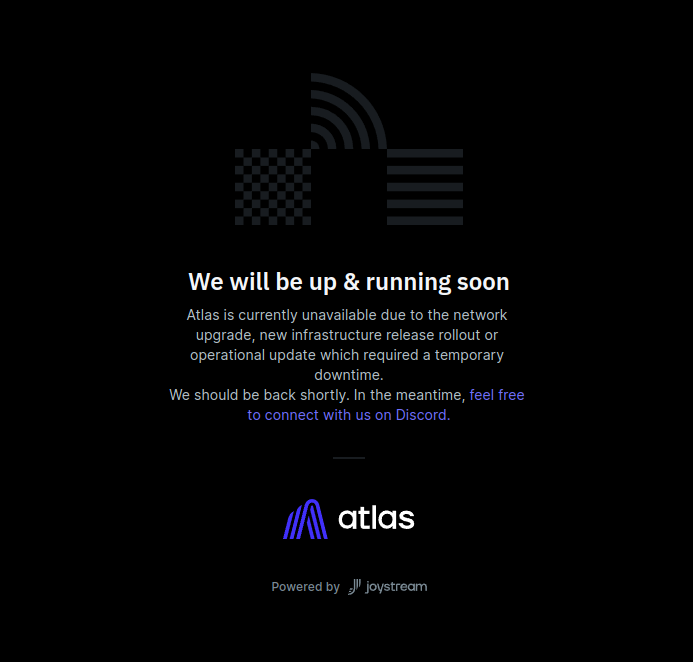

# Maintenance mode

The maintenance mode is useful when you want to temporarily disable the gateway for maintenance purposes, for example when you're [upgrading Orion to a new version](./upgrading-orion.md) or you're experiencing some issues with your gateway and you want to prevent users from accessing it until you resolve them.

In order to switch the maintenance mode on or off, you can use `setKillSwitch` operator mutation. If you set `isKilled` argument of the mutation to `true`, the maintenance mode will be enabled, if you set it to `false`, it will be disabled.

```graphql
mutation SetKillSwitch {
  setKillSwitch(
    # Enable the maintenance mode
    isKilled: true
  ) {
    isKilled
  }
}
```



When the maintenance mode is enabled, the users will see a screen like this when trying to access your gateway:



However, as a Gateway Operator, you will still be able to use the GraphQL API to execute queries and mutations.