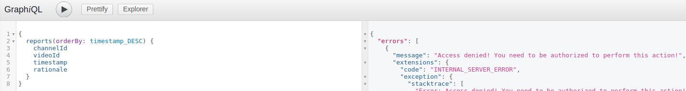

# Reported content

Users can report channels and videos that they find to be violating the content policy of your Gateway or that they deem inappropriate, offensive or harmful in any other way through [Atlas](https://github.com/Joystream/atlas):


On Orion side, those reports are handled by the `reportChannel` / `reportVideo` mutations.

As a Gateway operator, you will have access to all of the reports, along with the rationales provided by the users. You can query them using the `reports` query, for example:

```graphql
{
  # Query all reports ordered from newest to oldest
  reports(orderBy: timestamp_DESC) {
    channelId
    videoId
    timestamp
    rationale
  }
}
```


Be sure to authenticate yourself as a Gateway operator, otherwise you will see a following error when trying to execute the `reports` query:



To view the reported video using your gateway, you can simply open:
```
http://{ADDRESS_OF_YOUR_GATEWAY}/video/{VIDEO_ID}
```

Replacing the `{ADDRESS_OF_YOUR_GATEWAY}` with the address at which your gateway's frontend (Atlas) is being served and `{VIDEO_ID}` with the id of the video you want to view.

Similarly, to view the reported channel, you can go to:
```
http://{ADDRESS_OF_YOUR_GATEWAY}/channel/{CHANNEL_ID}
```

To learn how to exclude content from your Gateway, check out the _[Excluding content](#excluding-content)_ guide.