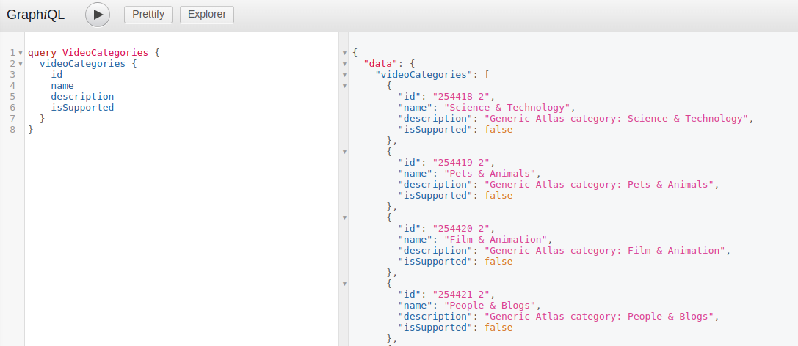
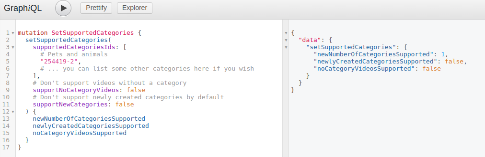
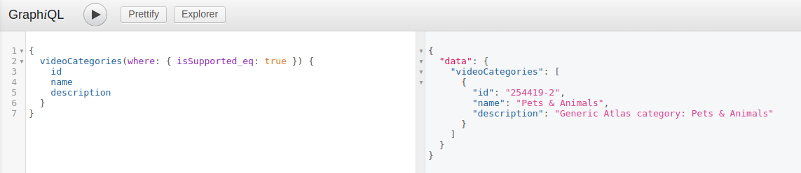
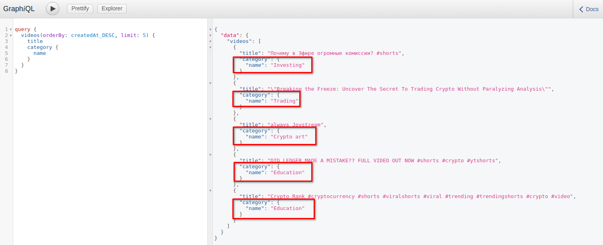
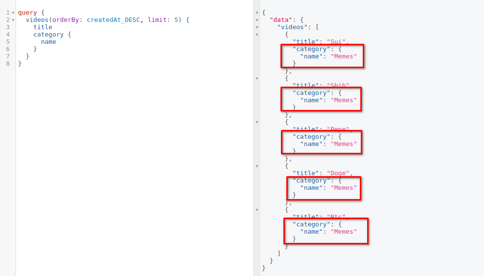

# Setting supported categories

The first mutation you will usually want to execute when setting up a new gateway is the `setSupportedCategories` mutation. It allows you to specify which video categories will be supported by your gateway and thus what kind of content would be available to its users.

First, in order to view the list of all available categories, you can execute the `videoCategories` query:



Let's say your gateway will be focused around cat / dog videos and therefore the only category you want to support is "Pets & Animals" (`254419-2`). In that case you can execute the `setSupportedCategories` mutation with the following arguments:

```graphql
mutation SetSupportedCategories {
  setSupportedCategories(
    supportedCategoriesIds: [
      # Pets and animals
      "254419-2",
      # ... you can list some other categories here if you wish
    ],
    # Don't support videos without a category
    supportNoCategoryVideos: false
    # Don't support newly created categories by default
    supportNewCategories: false
  ) {
    newNumberOfCategoriesSupported
    newlyCreatedCategoriesSupported
    noCategoryVideosSupported
  }
}
```

If the mutation executed successfully, you should see a response like this:



You can always check which categories are currently supported by executing the `videoCategories` query with a `where: { isSupported_eq: true }` argument:



As a gateway operator you will always see all categories and the videos belonging to them in the query results, regardless of whether they are currently supported by your gateway or not. You will also be able to see all [excluded content](./excluding-content.md) and other content that isn't normally available to the users.

For example, the query below is fetching the 5 latest videos. If you execute it as an operator, you will see that those videos don't necessarily belong to the categories you have selected as supported:



However, if you execute the same query after authenticating as a standard, anonymous user, you will only be able to see videos that belong to one of the supported categories:

